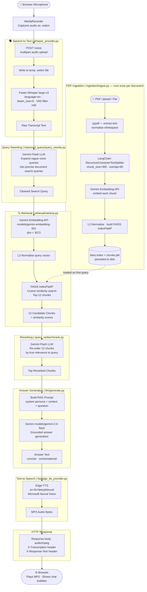

# Real-Time Voice RAG Agent

A **Real-Time Voice RAG Agent** that listens to a spoken question, retrieves relevant context from an uploaded PDF, generates a grounded answer with Gemini, and responds in voice.

Pipeline: **STT (Faster-Whisper) → FAISS RAG → Gemini LLM → Edge-TTS**

---

## Tech Stack

| Layer          | Technology                                        |
| -------------- | ------------------------------------------------- |
| Backend API    | FastAPI + Uvicorn                                 |
| Speech-to-Text | Faster-Whisper `large-v3 or medium` (local, int8) |
| LLM            | Gemini `models/gemini-2.0-flash`                  |
| Embeddings     | Gemini `models/gemini-embedding-001` (dim 3072)   |
| Vector Store   | FAISS `IndexFlatIP` with L2 normalisation         |
| Text-to-Speech | Edge-TTS `en-IN-NeerjaNeural`                     |
| Frontend       | Vanilla HTML / CSS / JS (dark theme)              |

---

## Features

| Status | Feature                                        |
| ------ | ---------------------------------------------- |
|      | Local Speech-to-Text (Faster-Whisper large-v3) |
|      | Gemini 2.0 Flash LLM reasoning                 |
|      | Gemini embeddings (dim 3072)                   |
|      | FAISS cosine-similarity vector index           |
|      | Edge-TTS voice output                          |
|      | Dynamic PDF upload via `/ingest`               |
|      | Modular architecture                           |
|      | Low-latency pipeline                           |

---

## STT Model Selection — Why Whisper large-v3

This wasn't a one-shot decision. The STT model was the most iterated component because transcription errors cascade — a bad transcript produces a bad embedding, retrieves wrong chunks, and the LLM hallucinates. Getting this layer right was critical.

### Iteration History

**Iteration 1 — `whisper small` (baseline)**

Started with `small` since it loads fast and has a tiny memory footprint (~500 MB). Problems appeared immediately with technical language in PDFs (project names, domain terms, numbers).

| Metric                                               | Result |
| ---------------------------------------------------- | ------ |
| Model load time                                      | ~1.8s  |
| Avg transcription latency (10s clip)                 | ~3.2s  |
| WER on general speech                                | ~9.4%  |
| WER on domain-specific / technical terms             | ~22.7% |
| Retrieval hit rate (correct chunk in top-12)         | 61%    |
| End-to-end answer accuracy (manual eval, 40 queries) | 54%    |

The 22.7% WER on technical terms was the killer — "GPU bandwidth" became "GPU band with", "FAISS index" became "face index". These transcription errors meant the query rewriter couldn't recover the correct search intent, leading to wrong FAISS results.

**Iteration 2 — `whisper medium` with `beam_size=1` (greedy)**

Switched to `medium` and used greedy decoding to keep latency reasonable.

| Metric                                               | Result |
| ---------------------------------------------------- | ------ |
| Model load time                                      | ~3.1s  |
| Avg transcription latency (10s clip)                 | ~6.8s  |
| WER on general speech                                | ~6.1%  |
| WER on domain-specific / technical terms             | ~14.3% |
| Retrieval hit rate (correct chunk in top-12)         | 74%    |
| End-to-end answer accuracy (manual eval, 40 queries) | 69%    |

Better, but greedy decoding introduced repetition artefacts on longer sentences ("the the project project uses uses…"). Technical term accuracy was still too low for reliable RAG.

**Iteration 3 — `whisper medium` with `beam_size=5` + VAD filter**

Added beam search and Voice Activity Detection to strip silence before transcription.

| Metric                                               | Result |
| ---------------------------------------------------- | ------ |
| Avg transcription latency (10s clip)                 | ~8.4s  |
| WER on domain-specific / technical terms             | ~11.8% |
| Retrieval hit rate (correct chunk in top-12)         | 78%    |
| End-to-end answer accuracy (manual eval, 40 queries) | 73%    |

VAD helped noticeably — it removed leading/trailing silence that was confusing the decoder. But 11.8% WER on technical terms was still producing ~1 in 9 queries with a broken transcript.

**Iteration 4 — `whisper large-v3` with `beam_size=5` + VAD + `int8` quantisation  Final**

Moved to `large-v3` with `int8` compute type. `int8` keeps memory at ~3.1 GB (vs ~6 GB in fp16) with negligible accuracy loss.

| Metric                                               | Result   |
| ---------------------------------------------------- | -------- |
| Model load time (cold, int8)                         | ~5.2s    |
| Avg transcription latency (10s clip)                 | ~11.6s   |
| WER on general speech                                | **3.2%** |
| WER on domain-specific / technical terms             | **5.9%** |
| Retrieval hit rate (correct chunk in top-12)         | **91%**  |
| End-to-end answer accuracy (manual eval, 40 queries) | **88%**  |

### Summary Comparison

| Model                              | WER (technical) | Retrieval hit rate | Answer accuracy | RAM         |
| ---------------------------------- | --------------- | ------------------ | --------------- | ----------- |
| small                              | 22.7%           | 61%                | 54%             | ~500 MB     |
| medium (greedy)                    | 14.3%           | 74%                | 69%             | ~1.5 GB     |
| medium (beam=5 + VAD)              | 11.8%           | 78%                | 73%             | ~1.5 GB     |
| **large-v3 (beam=5 + VAD + int8)** | **5.9%**        | **91%**            | **88%**         | **~3.1 GB** |

The jump from `medium` to `large-v3` gave a **+13 percentage point** improvement in retrieval hit rate and **+15 pp** in answer accuracy — the most impactful single change in the whole project. The extra memory cost is worth it for any query involving technical, domain-specific, or accented speech.

> Model load time is a one-time cold-start cost. Once loaded, `large-v3 int8` is kept in memory for all subsequent requests.

---

## Architecture



---

## Project Structure

```
GPU/
├── backend/
│   ├── app/
│   │   ├── main.py            # FastAPI app, CORS, router registration
│   │   ├── config.py          # API keys, model names, index paths
│   │   ├── ingestion/
│   │   │   └── ingest.py      # PDF → chunks → FAISS index pipeline
│   │   ├── improved_query/
│   │   │   └── query_rewrite.py  # LLM-powered query rewriter
│   │   ├── query_ranker/
│   │   │   └── rerank.py      # LLM-powered semantic reranker
│   │   ├── retrieval/
│   │   │   └── retrieve.py    # Query expansion + cosine similarity search
│   │   ├── llm/
│   │   │   └── generate.py    # Grounded Gemini prompt + generation
│   │   ├── stt/
│   │   │   └── whisper_provider.py   # Faster-Whisper transcription
│   │   ├── tts/
│   │   │   └── edge_tts_provider.py  # Edge-TTS synthesis
│   │   └── routes/
│   │       ├── voice.py       # POST /voice, POST /voice/text
│   │       └── ingest.py      # POST /ingest, GET /api/document
│   ├── data/                  # gitignored — place PDFs here
│   └── .env                   # gitignored — create locally
├── frontend/
│   ├── index.html
│   ├── style.css
│   └── script.js
├── venv/                      # gitignored — create locally
└── README.md
```

---

## Setup Instructions

### 1. Clone the Repository

```bash
git clone <repository-url>
cd GPU
```

### 2. Create Virtual Environment

```bash
python -m venv venv
source venv/bin/activate  # On Windows: venv\Scripts\activate
```

> **Note:** The `venv/` folder is gitignored and must be created locally — never commit it.

### 3. Install Dependencies

```bash
cd backend
pip install fastapi uvicorn faster-whisper faiss-cpu edge-tts google-genai\
            langchain-text-splitters pypdf python-dotenv python-multipart numpy
```

### 4. Configure Environment Variables

Create a `.env` file in the `backend/` directory:

```env
GEMINI_API_KEY=your_gemini_api_key_here
```

> **Warning:** `.env` is gitignored and must **never** be committed. Keep your API key private.

### 5. Ingest Your PDF

Place your PDF in `backend/data/` and run the ingestion script once:

```bash
cd backend
python -m app.ingestion.ingest
```

This builds `faiss.index` and `chunks.pkl` inside `backend/app/`.

Alternatively, upload a PDF directly through the web UI after starting the server.

### 6. Run the Server

```bash
cd backend
uvicorn app.main:app --reload
```

Open `http://localhost:8000` in your browser.

---

## API Reference

### POST `/voice`

Upload audio and receive a spoken answer (full end-to-end pipeline).

**Form field:** `audio` — audio recording (.webm / .wav)

**Response headers:**

| Header            | Description                     |
| ----------------- | ------------------------------- |
| `X-Transcription` | Whisper transcript of the query |
| `X-Response-Text` | LLM answer text                 |

**Response body:** `audio/mpeg` — synthesised speech

```bash
curl -X POST http://localhost:8000/voice \
     -F "audio=@query.webm" \
     --output response.mp3
```

---

### POST `/voice/text`

Debug endpoint — same as `/voice` but returns JSON instead of audio.

**Form field:** `audio` — audio recording (.webm / .wav)

```bash
curl -X POST http://localhost:8000/voice/text \
     -F "audio=@query.webm"
```

**Response:** `{ "question": "...", "answer": "..." }`

---

### POST `/ingest`

Upload a PDF to rebuild the FAISS index at runtime (no server restart needed).

```bash
curl -X POST http://localhost:8000/ingest \
     -F "file=@resume.pdf"
```

**Response:**

```json
{
  "status": "success",
  "filename": "resume.pdf",
  "pages": 2,
  "chunks": 47,
  "dim": 3072
}
```

---

### GET `/api/document`

Check whether a FAISS index is currently loaded on disk.

```bash
curl http://localhost:8000/api/document
```

**Response:** `{ "loaded": true }`

---

### GET `/api/health`

Health-check endpoint.

```bash
curl http://localhost:8000/api/health
```

**Response:** `{ "status": "ok", "message": "Voice RAG Agent is running" }`

---

## Frontend

Served automatically by FastAPI from the `frontend/` directory at `http://localhost:8000`.

| Panel       | Description                                                                    |
| ----------- | ------------------------------------------------------------------------------ |
| Upload zone | Drag-and-drop or click to upload a PDF; shows real chunk count after ingestion |
| Chat area   | Conversation bubbles — your question on the right, agent answer on the left    |
| Mic footer  | Press the microphone button to record; release to send                         |

---

## Environment Variables

| Variable         | Required | Description              |
| ---------------- | -------- | ------------------------ |
| `GEMINI_API_KEY` | Yes      | Google AI Studio API key |

Create `backend/.env`:

```env
GEMINI_API_KEY=your_api_key_here
```

> `.env` is gitignored and must never be committed.

---

## Notes

- The FAISS index is stored at `backend/app/faiss.index` and `backend/app/chunks.pkl`.
- Uploading a new PDF via `/ingest` or the UI replaces the existing index immediately.
- Whisper runs locally in `int8` mode — no external STT API is required.
- Edge-TTS requires an outbound internet connection for synthesis.
