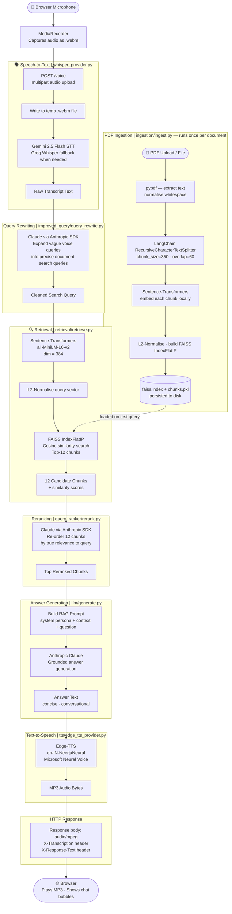

# Real-Time Voice RAG Agent

A **Real-Time Voice RAG Agent** that listens to a spoken question, retrieves relevant context from an uploaded PDF, generates a grounded answer with Claude, and responds in voice.

Pipeline: **STT (Gemini 2.5 Flash + Groq fallback) → local embeddings + FAISS RAG → Claude LLM → Edge-TTS**

---

## Tech Stack

| Layer          | Technology                                         |
| -------------- | -------------------------------------------------- |
| Backend API    | FastAPI + Uvicorn                                  |
| Speech-to-Text | Gemini 2.5 Flash + Groq Whisper fallback           |
| LLM            | Anthropic Claude `claude-opus-4-8`                 |
| Embeddings     | Sentence-Transformers `all-MiniLM-L6-v2` (dim 384) |
| Vector Store   | FAISS `IndexFlatIP` with L2 normalisation          |
| Text-to-Speech | Edge-TTS `en-IN-NeerjaNeural`                      |
| Frontend       | Vanilla HTML / CSS / JS (dark theme)               |

---

## Features

| Status | Feature                                 |
| ------ | --------------------------------------- |
|        | Gemini 2.5 Flash STT with Groq fallback |
|        | Claude reasoning via Anthropic API      |
|        | Local Sentence-Transformers embeddings  |
|        | FAISS cosine-similarity vector index    |
|        | Edge-TTS voice output                   |
|        | Dynamic PDF upload via `/ingest`        |
|        | Modular architecture                    |
|        | Low-latency pipeline                    |

---

## Speech-to-Text

The voice pipeline currently uses Gemini 2.5 Flash for transcription. If Gemini STT fails or returns no text, the code falls back to Groq Whisper (`whisper-large-v3`) when `GROQ_API_KEY` is available.

This means the README should not describe Whisper-only local STT as the primary path anymore. The current design is:

- Gemini 2.5 Flash for transcription
- Groq Whisper as a fallback
- Claude for query rewriting, reranking, and answer generation

---

## Architecture


```mermaid
flowchart TD
    A([🎤 Browser Microphone]) --> B[MediaRecorder\nCaptures audio as .webm]
    B --> C[POST /voice\nmultipart audio upload]

    subgraph STT ["🗣️ Speech-to-Text  |  whisper_provider.py"]
        C --> D[Write to temp .webm file]
        D --> E[Gemini 2.5 Flash STT\nGroq Whisper fallback when needed]
        E --> F[Raw Transcript Text]
    end

    subgraph QR [" Query Rewriting  |  improved_query/query_rewrite.py"]
        F --> G[Claude via Anthropic SDK\nExpand vague voice queries\ninto precise document search queries]
        G --> H[Cleaned Search Query]
    end

    subgraph RAG ["🔍 Retrieval  |  retrieval/retrieve.py"]
        H --> I[Sentence-Transformers\nall-MiniLM-L6-v2\ndim = 384]
        I --> J[L2-Normalise query vector]
        J --> K[FAISS IndexFlatIP\nCosine similarity search\nTop-12 chunks]
        K --> L[12 Candidate Chunks\n+ similarity scores]
    end

    subgraph RR [" Reranking  |  query_ranker/rerank.py"]
        L --> M[Claude via Anthropic SDK\nRe-order 12 chunks\nby true relevance to query]
        M --> N[Top Reranked Chunks]
    end

    subgraph LLM [" Answer Generation  |  llm/generate.py"]
        N --> O[Build RAG Prompt\nsystem persona + context + question]
        O --> P[Anthropic Claude\nGrounded answer generation]
        P --> Q[Answer Text\nconcise · conversational]
    end

    subgraph TTS [" Text-to-Speech  |  tts/edge_tts_provider.py"]
        Q --> R[Edge-TTS\nen-IN-NeerjaNeural\nMicrosoft Neural Voice]
        R --> S[MP3 Audio Bytes]
    end

    subgraph RESP [" HTTP Response"]
        S --> T[Response body: audio/mpeg\nX-Transcription header\nX-Response-Text header]
    end

    T --> U([🌐 Browser\nPlays MP3 · Shows chat bubbles])

    subgraph INGEST [" PDF Ingestion  |  ingestion/ingest.py  — runs once per document"]
        V([📁 PDF Upload / File]) --> W[pypdf — extract text\nnormalise whitespace]
        W --> X[LangChain RecursiveCharacterTextSplitter\nchunk_size=350 · overlap=60]
        X --> Y[Sentence-Transformers\nembed each chunk locally]
        Y --> Z[L2-Normalise · build FAISS IndexFlatIP]
        Z --> AA[(faiss.index + chunks.pkl\npersisted to disk)]
    end

    AA -.->|loaded on first query| K
```

---

## Project Structure

```
GPU/
├── backend/
│   ├── app/
│   │   ├── main.py            # FastAPI app, CORS, router registration
│   │   ├── config.py          # API keys, model names, index paths
│   │   ├── ingestion/
│   │   │   └── ingest.py      # PDF → chunks → FAISS index pipeline
│   │   ├── improved_query/
│   │   │   └── query_rewrite.py  # Claude-powered query rewriter
│   │   ├── query_ranker/
│   │   │   └── rerank.py      # Claude-powered semantic reranker
│   │   ├── retrieval/
│   │   │   └── retrieve.py    # Query expansion + cosine similarity search
│   │   ├── llm/
│   │   │   └── generate.py    # Grounded Claude prompt + generation
│   │   ├── stt/
│   │   │   └── whisper_provider.py   # Gemini STT with Groq fallback
│   │   ├── tts/
│   │   │   └── edge_tts_provider.py  # Edge-TTS synthesis
│   │   └── routes/
│   │       ├── voice.py       # POST /voice, POST /voice/text
│   │       └── ingest.py      # POST /ingest, GET /api/document
│   ├── data/                  # gitignored — place PDFs here
│   └── .env                   # gitignored — create locally
├── frontend/
│   ├── index.html
│   ├── style.css
│   └── script.js
├── venv/                      # gitignored — create locally
└── README.md
```

---

## Setup Instructions

### 1. Clone the Repository

```bash
git clone <repository-url>
cd GPU
```

### 2. Create Virtual Environment

```bash
python -m venv venv
source venv/bin/activate  # On Windows: venv\Scripts\activate
```

> **Note:** The `venv/` folder is gitignored and must be created locally — never commit it.

### 3. Install Dependencies

```bash
cd backend
pip install -r requirements.txt
```

### 4. Configure Environment Variables

Create a `.env` file in the `backend/` directory:

```env
ANTHROPIC_API_KEY=your_anthropic_api_key_here
GEMINI_API_KEY=your_gemini_api_key_here
# Optional: used only for Groq Whisper fallback in STT
GROQ_API_KEY=your_groq_api_key_here
```

> **Warning:** `.env` is gitignored and must **never** be committed. Keep your API keys private.

### 5. Ingest Your PDF

Place your PDF in `backend/data/` and run the ingestion script once:

```bash
cd backend
python -m app.ingestion.ingest
```

This builds `faiss.index` and `chunks.pkl` inside `backend/app/`.

Alternatively, upload a PDF directly through the web UI after starting the server.

### 6. Run the Server

```bash
cd backend
uvicorn app.main:app --reload
```

Open `http://localhost:8000` in your browser.

---

## API Reference

### POST `/voice`

Upload audio and receive a spoken answer (full end-to-end pipeline).

**Form field:** `audio` — audio recording (.webm / .wav)

**Response headers:**

| Header            | Description             |
| ----------------- | ----------------------- |
| `X-Transcription` | Transcript of the query |
| `X-Response-Text` | LLM answer text         |

**Response body:** `audio/mpeg` — synthesised speech

```bash
curl -X POST http://localhost:8000/voice \
     -F "audio=@query.webm" \
     --output response.mp3
```

---

### POST `/voice/text`

Debug endpoint — same as `/voice` but returns JSON instead of audio.

**Form field:** `audio` — audio recording (.webm / .wav)

```bash
curl -X POST http://localhost:8000/voice/text \
     -F "audio=@query.webm"
```

**Response:** `{ "question": "...", "answer": "..." }`

---

### POST `/ingest`

Upload a PDF to rebuild the FAISS index at runtime (no server restart needed).

```bash
curl -X POST http://localhost:8000/ingest \
     -F "file=@resume.pdf"
```

**Response:**

```json
{
  "status": "success",
  "filename": "resume.pdf",
  "pages": 2,
  "chunks": 47,
  "dim": 384
}
```

---

### GET `/api/document`

Check whether a FAISS index is currently loaded on disk.

```bash
curl http://localhost:8000/api/document
```

---

## Frontend

Served automatically by FastAPI from the `frontend/` directory at `http://localhost:8000`.

| Panel       | Description                                                                    |
| ----------- | ------------------------------------------------------------------------------ |
| Upload zone | Drag-and-drop or click to upload a PDF; shows real chunk count after ingestion |
| Chat area   | Conversation bubbles — your question on the right, agent answer on the left    |
| Mic footer  | Press the microphone button to record; release to send                         |

---

## Environment Variables

| Variable            | Required | Description                                |
| ------------------- | -------- | ------------------------------------------ |
| `ANTHROPIC_API_KEY` | Yes      | Anthropic API key used for Claude          |
| `GEMINI_API_KEY`    | Yes      | Google AI Studio API key used for STT      |
| `GROQ_API_KEY`      | Optional | Used only if Gemini STT falls back to Groq |

Create `backend/.env`:

```env
ANTHROPIC_API_KEY=your_anthropic_api_key_here
GEMINI_API_KEY=your_gemini_api_key_here
```

> `.env` is gitignored and must never be committed.

---

## Notes

- The FAISS index is stored at `backend/app/faiss.index` and `backend/app/chunks.pkl`.
- Uploading a new PDF via `/ingest` or the UI replaces the existing index immediately.
- Claude is used for query rewriting, reranking, and answer generation.
- Embeddings are generated locally with Sentence-Transformers, so no embedding API key is required.
- Gemini is used for STT, with Groq Whisper as a fallback when needed.
- Edge-TTS requires an outbound internet connection for synthesis.
